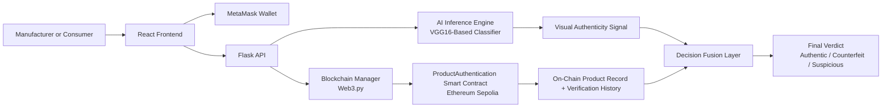
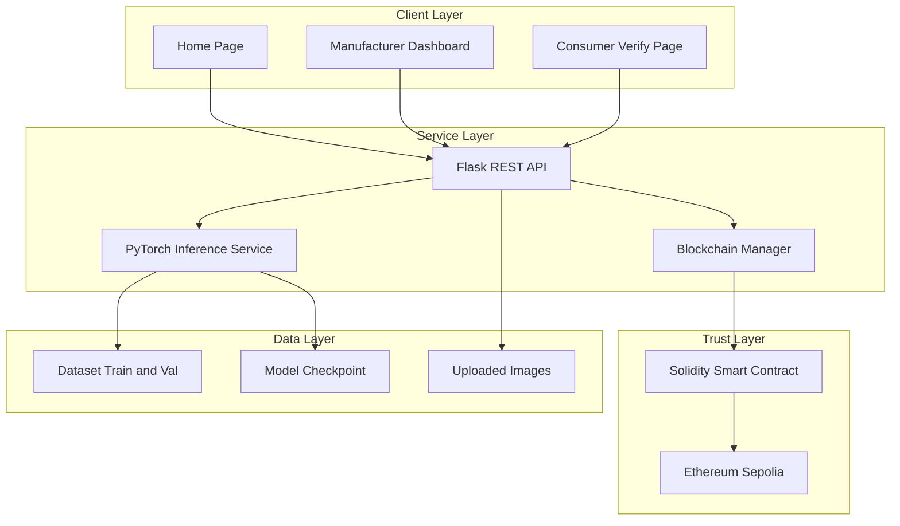
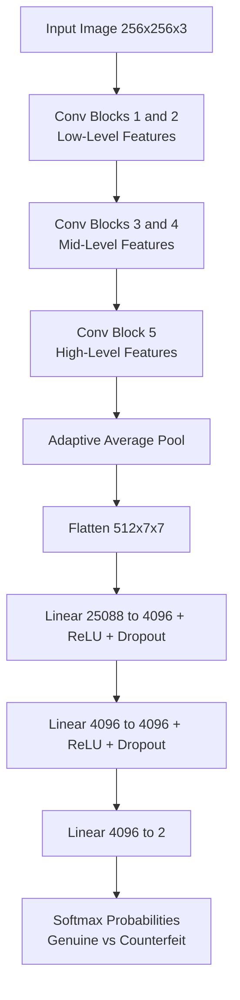
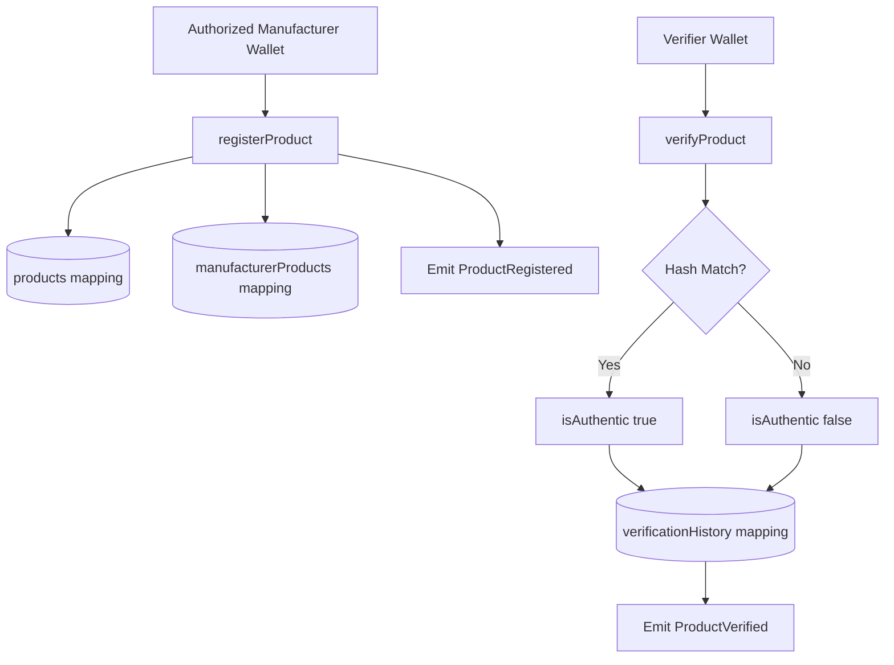
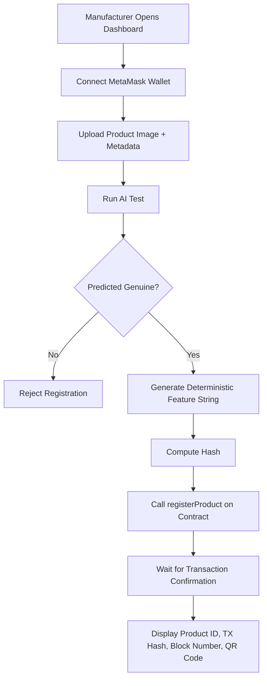
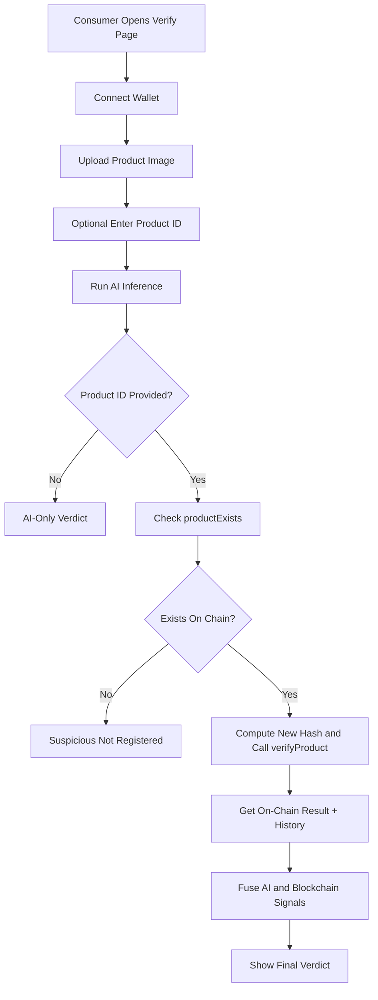

# Anti-Counterfeit Product Scanner

An end-to-end anti-counterfeit platform that combines computer vision and blockchain to authenticate consumer products in a practical, auditable, and tamper-resistant way. The project has four major layers: a deep learning layer for image-based counterfeit detection, a smart contract layer for immutable product registration and verification records, a Flask API layer that bridges AI and chain logic, and a React frontend that serves both manufacturers and consumers.

This repository is built as a minor project implementation that demonstrates how AI confidence and blockchain trust can be combined into a single decision pipeline. A manufacturer can register a product, the system generates a model-derived image signature, the signature gets anchored on-chain, and later any consumer can verify a scanned image against that registered record. The user-facing flow is designed around clear outcomes: authentic, counterfeit, or suspicious mismatch.

The implementation is intentionally practical:

- Python and PyTorch power model training and inference.
- Solidity and Ethereum Sepolia provide decentralized auditability.
- Flask + Web3.py handle contract interactions from the server side.
- React + Ethers.js + MetaMask enable wallet-based user actions in the browser.

The key objective is to reduce counterfeit risk in physical supply chains through multi-layer verification rather than relying on a single source of truth.

---

## 1. Project Goal and Motivation

Counterfeit products affect many industries, including footwear, cosmetics, pharmaceuticals, electronics, and luxury goods. Traditional anti-counterfeit methods such as simple barcodes, static labels, and even basic QR tags are frequently cloned. A stronger approach needs to answer two different questions at once:

1. Does this visual product instance look genuine according to learned visual patterns?
2. Does this product identity and fingerprint exist in a trusted registry that cannot be silently altered?

This project solves the first question using a VGG16-based classifier and the second question using a smart contract. The practical benefit is layered defense:

- AI catches visual anomalies and counterfeit appearance patterns.
- Blockchain catches identity spoofing and record tampering.
- Combined verdict reduces both false trust and false suspicion.

The result is a reproducible architecture that can be extended for production deployment with stronger datasets, richer feature extraction, and enterprise integration.

---

## 2. Repository Structure

Current codebase organization:

```text
anti-counterfeit-scanner/
├── backend/
│   ├── app.py
│   ├── blockchain.py
│   ├── config.py
│   └── requirements.txt
├── contracts/
│   └── ProductAuthentication.sol
├── dataset/
│   ├── train/
│   │   ├── genuine/
│   │   └── counterfeit/
│   └── val/
│       ├── genuine/
│       └── counterfeit/
├── frontend/
│   ├── package.json
│   └── src/
│       ├── pages/
│       ├── components/
│       └── utils/
├── models/
│   ├── train_model.py
│   ├── predict.py
│   ├── best_model.pth
│   └── training_curves.png
├── .gitignore
├── README.md
└── requirements.txt
```

Conceptual mapping:

- backend: API endpoints and blockchain orchestration
- contracts: on-chain logic for registration, verification, and history
- dataset: training and validation image corpus
- frontend: manufacturer and consumer user interfaces
- models: model definition, training loop, and inference wrapper

---

## 3. Block Diagram of Project

The block diagram below shows the complete pipeline from user interaction to decision and audit trail.



Design principle: AI and blockchain are not competing; they are complementary trust channels. The fusion step is critical because each channel has different strengths and weaknesses.

---

## 4. Project Architecture

### 4.1 High-Level Architecture



### 4.2 Frontend Architecture

Frontend pages:

- Home page: summary, stats, and navigation.
- Manufacturer page: upload product image, enter metadata, run AI check, write registration transaction.
- Verify page: upload image, optional product ID, run AI + blockchain verification, display verdict.

Frontend utilities:

- API client for backend endpoints.
- Ethers helper for wallet connection, contract instance, and image hash utility.

Frontend components:

- image upload handling with preview
- result cards with structured details
- QR code generation after successful registration
- wallet connect experience through MetaMask

### 4.3 Backend Architecture

Key backend responsibilities:

- validates file uploads and fields
- invokes model inference
- converts model output into a deterministic feature string for hashing
- checks authorization and product existence states
- signs and submits chain transactions through a configured wallet
- merges AI and blockchain results into final API response

Endpoints:

- GET /api/health
- POST /api/test-ai
- POST /api/register-product
- POST /api/verify-product
- GET /api/product/<product_id>
- GET /api/check-authorization

### 4.4 Data and Control Flow

Registration path:

1. Manufacturer uploads product image and metadata.
2. AI predicts genuine or counterfeit.
3. If counterfeit, registration is rejected.
4. If genuine, feature-derived hash is generated.
5. Product and hash are sent to smart contract.
6. Transaction receipt and record metadata are returned.

Verification path:

1. Consumer uploads image and optional product ID.
2. AI predicts class and confidence.
3. If product ID exists, chain data is queried.
4. On-chain verify function compares stored hash against new hash.
5. Final verdict is computed from AI + chain status.

---

## 5. VGG16 Architecture

The project uses a VGG16-based classifier adapted for binary classification (genuine vs counterfeit). VGG16 is a deep convolutional network known for consistent feature hierarchy: shallow layers detect edges and textures, mid layers detect motifs and local shapes, and deeper layers capture semantic composition.

### 5.1 Why VGG16

VGG16 is selected for this project because:

- It is stable and easy to fine-tune.
- Transfer learning from ImageNet accelerates convergence.
- Its behavior is well documented and reproducible.
- It performs strongly on many texture-sensitive tasks.

Counterfeit detection often depends on fine-grained packaging details, texture continuity, logo quality, stitching pattern, and print artifacts. VGG-style filters are effective in capturing these visual cues.

### 5.2 Model Adaptation in This Project

In this implementation:

- Pretrained VGG16 backbone is loaded.
- Early feature layers are partially frozen.
- Classifier head is replaced for two classes.
- Dropout is used to reduce overfitting.
- Cross-entropy loss and Adam optimizer are used.

### 5.3 VGG16 Layer Flow



### 5.4 Inference Output Contract

Inference returns:

- prediction label string
- normalized confidence
- genuine probability
- counterfeit probability

These values support both user messaging and deterministic hash generation for blockchain storage. In the current logic, a feature string is formed from genuine and counterfeit probabilities and then hashed with SHA-256 before on-chain registration and verification.

---

## 6. Blockchain Architecture

### 6.1 Smart Contract Design

The ProductAuthentication smart contract stores product identity and image signature references, then logs every verification event. Main structures include:

- Product struct: productId, productName, imageHash, manufacturer, registrationTime, metadata, exists, verificationCount.
- VerificationRecord struct: verifier, timestamp, result, location.
- mappings for products, manufacturer product lists, and verification history.
- authorized manufacturer whitelist with owner-controlled administration.

### 6.2 Blockchain Flow Diagram



### 6.3 On-Chain Trust Properties

What blockchain gives this system:

- immutability for registered records
- transparent verification history
- cryptographic auditability via transaction hashes
- role-based registration permissions through authorized manufacturers

### 6.4 Blockchain Manager in Backend

The backend BlockchainManager class:

- connects to RPC endpoint
- injects PoA middleware for compatible networks
- loads contract ABI
- signs transactions using configured private key
- sends register and verify transactions
- waits for receipts and returns tx metadata
- reads product details and existence checks

---

## 7. Detailed Working of the Project

### 7.1 Manufacturer Registration Workflow



Registration is intentionally guarded by AI first. This prevents obvious fake visual patterns from being written to the trusted registry. The chain call is made only if the AI gate passes.

### 7.2 Consumer Verification Workflow



Final decision logic:

- AI genuine + chain authentic => authentic
- AI counterfeit + chain mismatch/fail => counterfeit
- mismatch between channels => suspicious warning

### 7.3 Health and API Monitoring

The health endpoint reports:

- API status
- AI model load status
- blockchain connectivity state
- server timestamp

This supports quick diagnostics before operational use.

---

## 8. Hardware Setup

This section documents recommended hardware for development, training, and demonstration.

### 8.1 Minimum Setup (Development and Basic Demo)

- CPU: quad-core modern processor
- RAM: 8 GB
- Storage: 20 GB free (code, dependencies, sample images)
- GPU: optional
- Internet: stable connection for RPC and wallet actions

This is sufficient for API testing, frontend usage, and lightweight inference with CPU-only PyTorch wheels.

### 8.2 Recommended Setup (Comfortable Training)

- CPU: 6 to 8 cores
- RAM: 16 GB or more
- GPU: NVIDIA GPU with at least 6 GB VRAM for faster training
- Storage: SSD with 50 GB free
- OS: Windows 10/11, Linux, or WSL2-based setup

### 8.3 Demo Environment Checklist

- MetaMask extension installed and unlocked
- Sepolia test ETH available in wallet
- contract address configured
- backend private key configured in environment file
- model checkpoint available at configured path

### 8.4 Optional Hardware Extensions

- high-resolution camera or mobile capture workflow
- QR scanner integration for faster product ID input
- kiosk mode system for in-store verification

---

## 9. Software Stack and Setup

### 9.1 Software Components

- Python 3.x
- Flask and flask-cors
- PyTorch and TorchVision
- Web3.py and eth-account
- Solidity contract (deployed externally)
- React frontend with Ethers.js and axios
- MetaMask browser wallet

### 9.2 Backend Setup

From backend directory:

```bash
pip install -r requirements.txt
python app.py
```

Environment variables typically include:

- RPC_URL
- CONTRACT_ADDRESS
- PRIVATE_KEY
- MODEL_PATH
- UPLOAD_FOLDER
- DEBUG

### 9.3 Frontend Setup

From frontend directory:

```bash
npm install
npm start
```

Open local frontend URL and connect MetaMask on Sepolia chain.

### 9.4 Model Training Setup

From models directory (or repository root with adjusted paths):

```bash
python train_model.py
```

Training script expects dataset in train and validation folders with genuine and counterfeit class directories.

---

## 10. Training and Validation

### 10.1 Dataset Organization

Expected format:

```text
dataset/
├── train/
│   ├── genuine/
│   └── counterfeit/
└── val/
	├── genuine/
	└── counterfeit/
```

The data loader scans each class directory, loads valid image files, applies transforms, and emits class labels for batch training.

### 10.2 Augmentation and Normalization

Training transform includes:

- resize to 256x256
- random horizontal flip
- random small rotation
- brightness and contrast jitter
- normalization with ImageNet statistics

Validation transform uses deterministic resize + normalization only.

### 10.3 Epochs

The configured epoch count in the training script is:

- 15 epochs

Model checkpointing is based on best validation accuracy. Whenever a new best validation accuracy is observed, the checkpoint is updated.

### 10.4 Training and Validation Graph

The script outputs a multi-panel graph that includes:

- training and validation loss
- training and validation accuracy
- best validation line marker

The graph is saved as training_curves.png by the script.

### 10.5 Accuracy and Performance Discussion

Training and validation accuracy should be interpreted carefully. High accuracy on a limited dataset can be optimistic if the sample diversity is narrow. For robust deployment:

- increase product variety
- include difficult counterfeit conditions
- include varied lighting and camera devices
- reserve truly unseen test sets
- track precision and recall per class

---

## 11. Screenshots and Evidence Sections

The following sections are included exactly as requested. Place images in docs/screenshots and keep names aligned with the markdown references below.

### 11.1 Software Frontend Screenshots


### 11.2 Software Working Screenshots of Manufacturer and Consumer Page


### 11.3 Screenshot of Verification Process by AI


### 11.4 Screenshot of Verification Process by Blockchain Wallet, Ethereum, and Transaction Flow


### 11.5 Training and Validation Screenshot


### 11.6 Training and Validation Graph


### 11.7 Training and Testing Accuracy Screenshot and Graph


### 11.8 Optional Capture Checklist

When preparing presentation screenshots, capture the following in order:

1. Wallet connected state.
2. Product registration form filled.
3. Successful AI genuine output.
4. Register transaction confirmation.
5. Product verification with product ID.
6. Verification history list update.
7. AI counterfeit test example.
8. Etherscan transaction page with hash visible.

---

## 12. Blockchain Architecture Deep Dive

### 12.1 Authorization Model

The contract supports a manufacturer whitelist:

- contract deployer is owner
- owner can authorize or revoke manufacturers
- only authorized accounts can register new products

This prevents random addresses from polluting the registry with fake entries.

### 12.2 Product Record Model

Each product stores:

- immutable registration identity fields
- feature-derived image hash
- metadata string (often JSON serialized)
- manufacturer address and registration timestamp
- running count of verifications

### 12.3 Verification History Model

Every verify call records:

- verifier address
- verification timestamp
- boolean result
- location string

This creates an auditable chain of trust events useful for forensic analysis and supply chain monitoring.

### 12.4 Event-Driven Traceability

Events emitted:

- ProductRegistered
- ProductVerified
- ManufacturerAuthorized
- ManufacturerRevoked

These can be indexed by off-chain services for dashboards, alerts, and analytics pipelines.

---

## 13. Security Considerations

### 13.1 Current Protections

- access control on registration
- no registration of AI-detected counterfeit in backend logic
- deterministic hashing for repeatable checks
- immutable event logs on blockchain

### 13.2 Risks to Handle Before Production

- secure handling of backend private keys
- robust validation against adversarial or manipulated images
- stronger feature representation than simple probability-string hashing
- wallet UX hardening and transaction risk messaging
- API rate limiting and abuse protection

### 13.3 Recommended Improvements

- use HSM or secure vault for private key management
- migrate to extracted CNN embedding vectors for richer feature hashes
- add multi-image registration per product with threshold consensus
- implement anomaly monitoring and signed backend attestations
- introduce decentralized storage for metadata proofs if needed

---

## 14. Project Architecture vs Block Diagram vs Blockchain Architecture

To avoid confusion:

- Block Diagram shows end-to-end system blocks and data flow.
- Project Architecture explains layered components (frontend, backend, model, contract).
- Blockchain Architecture focuses only on contract state, functions, and transaction flow.

All three views are included in this README because each answers a different stakeholder question:

- reviewers ask how the full system works
- developers ask where each module belongs
- auditors ask how trust and data integrity are ensured

---

## 15. Example End-to-End Walkthrough

This walkthrough can be used for demo day:

1. Start backend API and ensure health is green.
2. Start frontend app and open home page.
3. Connect MetaMask on Sepolia.
4. Go to manufacturer page and upload known genuine product image.
5. Enter product ID and metadata, then submit.
6. Approve wallet transaction and wait for confirmation.
7. Capture result card and QR code screenshot.
8. Open verify page, upload another image of same product.
9. Enter product ID and location.
10. Approve verify transaction.
11. Observe final verdict and history list.
12. Open Etherscan transaction link and capture proof screenshot.

For suspicious flow:

1. Upload a counterfeit-style image.
2. Observe AI warning and suspicious/counterfeit outcome.
3. Capture confidence distribution screenshot.

---

## 16. Training and Validation Reporting Template

Use this template to maintain academic reporting quality in your project documents:

- total train samples per class
- total validation samples per class
- epoch-wise train loss
- epoch-wise validation loss
- epoch-wise train accuracy
- epoch-wise validation accuracy
- best validation epoch and metric
- confusion matrix on holdout test set
- false positive and false negative analysis

This project already plots core curves and checkpoint metrics, and can be extended with additional evaluation scripts.

---

## 17. Future Scope

Potential enhancements:

- mobile camera app for in-store instant verification
- embedding similarity with thresholded distance rather than probability string
- multi-modal verification (image + text + serial data)
- NFT-like digital product passports for lifecycle tracking
- batch registration APIs for enterprise onboarding
- analytics dashboard for counterfeit hotspot detection
- multilingual UX for broader consumer adoption

---

## 18. Conclusion

This project demonstrates a meaningful anti-counterfeit architecture by combining deep learning and blockchain in a single operational workflow. The AI model provides visual intelligence, while smart contracts provide immutable trust and transparent verification history. The backend orchestrates both channels and the frontend gives distinct, practical experiences for manufacturers and consumers.

From a systems perspective, the project covers the full stack of modern trust-aware software:

- model training and inference
- web service integration
- decentralized ledger interaction
- wallet-driven user flows
- audit-friendly outputs and evidence capture

From an academic perspective, it demonstrates applied machine learning, applied blockchain engineering, and full-stack integration under a socially relevant use case.

With stronger datasets, richer feature extraction, and production-grade deployment controls, this foundation can evolve into a robust real-world anti-counterfeit platform.

---

## 19. Quick Links

- Smart contract source: contracts/ProductAuthentication.sol
- Backend API: backend/app.py
- Blockchain manager: backend/blockchain.py
- Model training: models/train_model.py
- Model inference: models/predict.py
- Frontend app: frontend/src/App.js

---

## 20. Acknowledgment

Built as a KIIT University minor project focused on practical counterfeit prevention using AI and blockchain.

